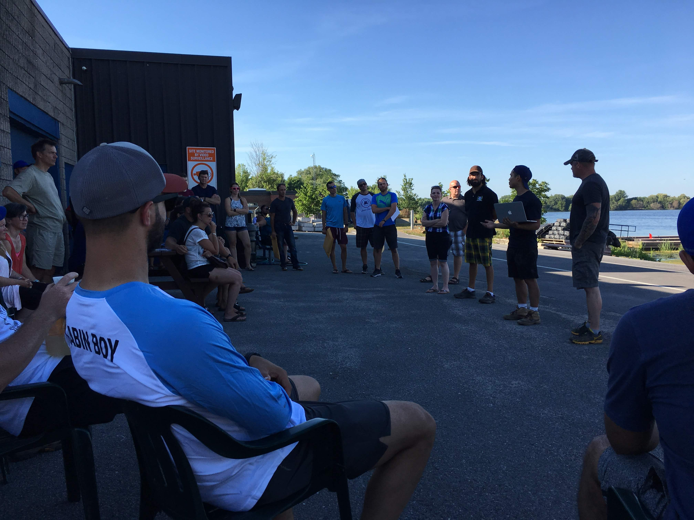

# K2O - Kingston to Ottawa

Ontarios längstes Marathon-Paddelrennen

## Warum macht man sowas?

Das [K2O](http://kingston2ottawa.ca) ist eine besondere Regatta. Für mich ist es _das_ Paddelrennen an sich. Es findet auf dem [Rideau Waterway](https://en.wikipedia.org/wiki/Rideau_Canal) statt, der von Parks Canada verwaltet wird. Die Wasserstraße ist von der UNESCO zum Weltkulturerbe erklärt worden. Sie verbindet die alte Hauptstadt Kingston mit der heutigen Hauptstadt Ottawa.

Für diejenigen, die die Gegend erkunden wollen, gibt es gute Online-Ressourcen, z. B. [Watson's Paddling Guide to the Rideau Canal](http://www.rideau-info.com/canal/paddling/guides.html). Die Tour von Ottawa nach Kingston oder umgekehrt ist eine gut einwöchige Reise. Der Spiegel hat im Jahre 2007 mal einen netten Artikel zu dem Thema veröffentlicht. Die Überschrift heißt [Paddeln wie die Pioniere](http://www.spiegel.de/reise/aktuell/ottawa-per-kanu-paddeln-wie-die-pioniere-a-494941.html) und ist im Archiv online verfügbar.

Es gibt noch andere Ultra-Marathon-Paddelrennen in Nordamerika, wie das [Yukon River Quest], [Missouri American Water MR340], die[Texas Water Safari]. Diese sind zwar alle länger, aber alle von ihnen haben verpflichtende Zwischenstopps oder erwarten zumindest, dass die Teilnehmer unterwegs Pausen einlegen.

Nicht so im K2O. Die Siegerteams schaffen es oft unter 24 Stunden und die Zielschlußzeit beträgt 36 Stunden.

Das erste Mal las ich über das Rennen im Jahr 2014. Es gab da ein Webseite über ein verrückte Rennen auf dem Rideau. Damals hatte ich nur einen 14 Fuß langen 29 Zoll breiten Sit-on-Top-Kajak. Das war kein Boot, mit dem man an Rennen hätte teilnehmen können. Wie sich herausstellte, war der Rennorganiator ein Kollege meiner Frau. Als er von meinem Interess erfuhr hat er versucht, mich als Mitglied für eine Staffel zu gewinnen. Aber ich traute mich nicht, ich war damals noch nicht soweit. Im Sommer des Jahre reiste ich zu einer Paddeltour nach Island. Im Herbst kaufte ich dann mein erstes Fiberglasboot - ein Wilderness Tempest 170PRO.

Die Dinge haben sich geändert. Das K2O hat sich geändert. Inzwischen hatten sie eine halbe Strecke für Feiglinge wie mich im Angebot, die beim ersten Mal keine 200 km fahren wollten.

100 km schienen machbarer.

Ich fand andere Verrückte. Einer davon arbeitet auf dem gleichen Flur wie ich im Büro. Wir beide paddelten von der 8th Line Brück nördlich von Westmontrose nach Paris, Ontario auf Grand River. Wir machten [88,3 km](https://www.endomondo.com/users/2331405/workouts/578506690). Unsere Arbeitskollegen nannten es das "EpiC Paddeln". Der Name blieb. Wir waren enttäuscht, dass wir die magische 90 km-Marke nicht erreicht hatten. Deswegen starteten wir 2017 einige Kilometer weiter flussaufwärts an der unteren Brücke der Elora-Schlucht. Den Tag zeigte der Kilometerzähler auf meinem GPS [93.4 km](https://www.endomondo.com/users/2331405/workouts/958850726) an. Angesichts der neuen Strecke war es auch viel eingängiger zu sagen: "Wir paddelten von der Elora-Schlucht nach Paris, an einem Tag." Niemand wusste, wo die 8th Line den Grand überquert.
Heuer - 2018 - waren wir vier Kajaks und ein Kanu, welche die gesamte Strecke bewältigten (https://www.endomondo.com/users/2331405/workouts/1137787341). Wir planen ein **Epic Paddeln** für das nächste Jahr. Es ist offen für alle, die glauben, in 14 Stunden 94 km paddeln zu können. Möglicherweise haben wir eine Tradition gestartet.

Im August 2016 nahm ich mit meinem 17ft Tourenkajak am K&frac12;O teil. Ich paddelte von Kingston nach Smiths Falls in 16 Stunden und 24 Minuten. Auf dem Weg dorthin mußte ich wegen eines Gewitters mit sintflutartigem Regen eine Stunde Unterschlupf suchen.
Ich bemerkte, dass die guten Paddler alle in einem EPIC-Kajak zu sein schienen. Nach dem Rennen beschloß ich, wenn ich jemals die volle Strecke paddeln würde bräuchte ich auch einen EPIC.

Daraufhin habe ich auf Kijiji einen Alarm für EPICs eingerichtet. Als im September eine Anzeige erschien für einen EPIC 18X Sport auftauchte mußte ich einfach zuschlagen. Es war ein Schnäppchen.

Mein Plan war am Rennen in 2017 teilzunehmen. Im November 2016 fuhren wir nach Florida, wo ich einen brandneuen EPIC 18X Sport mieten konnte. Ich paddelte jeden Tag durch die Mangroven und hatte nach zwei Wochen 320 km zurückgelegt. Danach meldete ich für den Wettbewerb in 2017. Wir hatten unser Epic Paddel im Frühsommer. Insgesamt hatte ich mehr als 1,200 km zurückgelegt. Ich hatte eine größere Supportmannschaft aufgestellt, um auch die Nacht abzudecken. Ich war vorbereitet.

Worauf ich nicht vorbereitet war, war eine Verletzung.

10 Tage vor dem Rennen klemmte ich mir einen Nerv im rechten Bein. Ich folgte dem Rat meines Arztes und sagte meinen Start am Dienstag vor dem K2O 2017 ab. Ich war am Boden zerstört.

Ein neues Jahr, ein neues Rennen. Im Jahr 2018 kam alles zusammen.

# Tages des Wettkampfs

## Freitag

Wir wohnen in Kitchener, ON. Wir nahmen uns den Freitag frei und fuhren nach Kingston. Ich hatte ein Hotelzimmer gebucht, das 15 Autominuten vom Start im Cataraqui Canoe Club entfernt war. Wir haben am Nachmittag eingecheckt. Ich hatte ein gutes Gespräch mit den Leuten von [Infinite Blue]. Meine Frau kaufte mir zu meinem Geburtstag im September eine Paddelhose, die ich für das Rennen trug.

Ich habe mein Boot im Club für die Nacht im Bootsschuppen einschließen lassen. Ein großes Dankeschön an die Clubmitglieder für die Erlaubnis, ihre Räumlichkeiten zu nutzen. Von dort ging es zum Abendessen in die Innenstadt von Kingston. Ich hatte ein großes Nudelgericht mit Huhn und Bier.

Der Alarm ging um 04:30 Uhr los. Während ich mich anzog, leitete ich die Kaffeemaschine im Zimmer. Es war zu früh, um etwas zu essen.
Wir kamen um 05:15 Uhr im Club an. Ich zog mein Kajak aus dem Bootshaus und bereitete mich auf den Start vor. Ich band meine kleine GPS-Halterung an das Deck, legte die Karten in das SealLine Kartenetui und befestigte sie an den Deckslinien. Ich lagerte den Paddelschwimmer hinter der hinteren Kurve, band das Ersatzpaddel und die Pumpe auf dem Achterdeck fest.
Die Wurfleine und das Essen gingen in die Tagesluke.

Ich habe etwas Wind bemerkt. Es war mehr, als ich am frühen Morgen erwartet hätte. Die Vorhersage für Samstag sah Süd- bis Südostwind mit Geschwindigkeiten um 10 - 15 km/h und noch mehr in Böen vor. Das hat mir nicht gut gefallen. Ich erinnerte mich an die Bedingungen im Jahr 2016, als wir sehr starke Winde von hinten hatten, die für ein sehr technisches Paddeln sorgten. Meine Bedenken betrafen nicht so sehr das Flusspaddeln. Der Wind wäre dort nur ein Ärgernis. Ich hatte Angst vor dem Abschnitt, in dem wir am Rande des Ontariosees unterwegs waren.

Ich kenterte am Lake Huron im Urlaub in der Nähe von Bayfield, ON. Ich blies mehrere Rollen und musste den Ausgang nass machen. Ich konnte auch nicht mit meinem Paddelschwimmer umgehen. Ich brauchte nur ein paar Minuten, um mit meinem Boot ans Ufer zu schwimmen. Aber es hatte einen Einfluss auf mein Selbstvertrauen. Ich habe mehrmals auf dem Guelph Lake trainiert, um mein Rollen zu verbessern und Erfahrungen mit der Selbstrettung zu sammeln. Aber das Gefühl des Unbehagens hatte mich nicht verlassen.

Ich habe mein Handy in den Energiesparmodus versetzt. Es sollte 30 Stunden dauern. Ich beschloss, es auszuschalten, weil das vielleicht nicht genug ist. Meine Idee war, es wieder einzuschalten, wenn ich die langen Etappen des Rennens bestreiten würde. Trotzdem habe ich es in eine wasserdichte Hülle gepackt und in der Vordertasche meiner PFD mit einem Karabinerhaken gesichert verstaut.

Am Abend zuvor hatte ich eine Schale Joghurt mit einer halben Tasse Haferflocken und Rosinen zubereitet. Das war mein Frühstück. Ich rechnete knapp 2 Stunden, bevor ich an der ersten Schleusenstation in Kingston Mills ankam. Lynne würde die Zeit nutzen, um meine Thermosflaschen mit Kaffee zu füllen. Ich hatte eineinhalb Liter Wasser in meiner Trinkblase auf dem Rücken, was reichlich sein würde.

Ich habe mein[SPOT3]-Gerät vom Registrierungsdeck abgeholt. Der SPOT3 ist ein Zwei-Wege-Satelliten-Tracker. Das Gerät sendet alle 5 Minuten ein Positions-Update über Satellit. Es kann ein Lebensretter sein, wenn man sich in entlegenen Gebieten verirrt. Es gibt den Organisatoren die Position der einzelnen Rennfahrer und steuert auch den Live-Online-Tracker während des Rennens. Ich konnte auch das ganze Rennen nachspielen, wie ich gestern Abend auf der Webseite erfahren habe.

Ein letzter Lauf zur Toilette, wo ich eine kurze Aufstellung fand und dann ging ich zum Dock.

Der Start war der übliche überfüllte Ort. Ich bleibe immer am Ende des Feldes. Ich kämpfe um die Ankunft, nicht um einen Platz auf dem Podium. Während wir auf das Signal warteten, bemerkte ich, dass bereits ein Paddler im Wasser war und ein leeres Kajak aus dem Weg geschoben wurde. Jemand kenterte vor dem Start.

Um 06:01:00 Uhr ging es schließlich los.

## Kingstons to Rideau Narrows (73 km)

Zuerst ging es raus auf den Ontariosee. Es war noch unangenehmer, als ich befürchtet hatte. Die Wellen waren ungefähr 0,5m hoch und kamen von links. Ich versuchte die Wellen zu schneiden, um meine Balance besser zu kontrollieren. Ein paar Mal wäre ich fast gekentert.
Während ich gegen die Wellen kämpfte, hatte Shawn (Team Creek Freak) bereits die Wendeboje umrundet und kam auf seinem Weg zurück nach Norden an mir vorbei. Der Mann ist eine Maschine!
Hinter einem Wellenbrecher direkt neben dem Ahoi-Bootsvermietung konnte ich kurz verschnaufen und meine Handschuhe anziehen. Das hätte ich gleich von Anfang an machen sollen! Danach gings weiter.

Nach der Wende ging es zurück in den Cataraqui Fluss während ich fortwährend unzitierbare deutsche und englische Schimpfwörter grummelte. Ich nahm einen Kurs hart am Wind, um den Schutz der Halbinsel von Fort Frederick zu erreichen. Es gab einige Paddler in Freizeitkajaks ohne Spritzschutz. Ich frage mich, wie viel Wasser sie genommen haben, während sie da draußen waren. Als ich am RMC (Royal Military College) vorbeikam, entdeckte ich ein Kanu auf dem Steg dort. Die Jungs hatten so viel Wasser mitgenommen, dass sie an Land gehen mussten, um ihr Boot zu leeren.

Der Cataraqui war geschützt vom Wind. Ich machte gute Fortschritte und war um 7:32 am Dock der Kingston Mills nach den ersten 12 km des Rennens.

Wegen meines Kajaks mußte ich in der "Wettkampfkategorie" starten. Ursprünglich hatte ich wie vor zwei Jahren für die "Freizeitkategorie" gemeldet. Die Rennleitung hatte jedoch meine Anmeldung nicht akzeptiert und mich in die Wettkampfkategorie eingestuft. Mit einem EPIC wird man nicht mehr als Freizeitpaddler angesehen. Das wäre kein großes Problem außer für die Regel, dass man keine Unterstützung beim Bewegen seines Kajaks in Anspruch nehmen darf. Die Regeln schreiben vor, dass ich mein Boot ohne fremde Hilfe aus dem Wasser heben muss. Ich bin die einzige Person, die mein Boot bewegen darf. Meine Crew kann das Boot beim Ein- und Aussteigen stabilisieren, darf es aber nicht bewegen. Ausnahme sind die Schleusen in Old Slys und Long Island, da diese zu schwer zu umtragen sind. Dort wäre es ein Sicherheitsrisiko.

Na gut.

Ich habe die folgende Technik: Zuerst hebe ich das Boot auf meine Oberschenkel und in einem zweiten Schritt lege ich es auf meine (meist rechte) Schulter. Ich hatte vergessen, dass Kingston Mills eine der längeren Portagen hat. Man muß 350 m weit gehen und dann noch 14 m Höhe gewinnen. Nach 100 m mit meinem Kajak habe ich das eingesehen und das Boot auf meinen Wagen gesetzt.
Bevor es weiter ging packte ich meinen Starbucks Latte und den Ingwer-Melasse-Keks, den Lynne für mich hatte, ein. Ich weiß, das klingt für manche Leser nicht nach sportlichem Essen, aber für mich funktionierts.

Hinter Kingston Mills beginnt der Styx. Ich konnte zwei Kajakfahrer vor mir sehen. Wie ich später erfahren sollte, war einer von ihnen Brian King aus Ottawa (Team Haulin' Yak - King). Ich versuchte zu ihnen aufzuschließen.

Am Ende des offeneren Fluss Styx führt die Strecke später in engere Kanäle. Ich passierte die Schleusen Lower Brewers und Upper Brewers.

Beim Briefing am Freitagabend wurden wir an die Brass Point Brücke erinnert. Sie ist sehr niedrig, aber wenn man den Kopf unten hält, kann man als Paddler ohne Probleme passieren.
Als ich mich der Brücke näherte, wurde sie für einen Jetski geöffnet. Der Brückenwärter hielt die Autos für mich noch 30 Sekunden länger zurück und ließ mich ebenfalls passieren. War sehr praktisch.

Ein Wort zu den Jetskies oder Seadogs, wie die Bombardier-Marke hier genannt wird. Die sind ein allgemeines Ärgernis. Sie scheinen weniger Etikette zu haben als "normale" Bootsführer. Ich bin mir sicher, diese Jetski-Fahrer sind nette Leute - an Land. Auf dem Wasser sind sie unnausstehlich.
Bei einer Gelegenheit in einem der engen Kanäle vor den Jones Falls waren zwei Jetskis nah bei mir: Ein Mann - wahrscheinlich der Vater und ein anderer mit einer Frau und einem Teenager. Langsam passierten sie mich von hinten kommend und erzeugten eine große Bugwelle. Dann hielten sie 50 m vor mir an, um sich zu besprechen, während ich sie erneut überholte. Zwei Minuten später schienen sie eine Entscheidung getroffen zu haben und zogen weiter, nur um mich noch einmal zu überholen. Ich habe tödliche Drohungen ausgestoßen und alle Jetski-Fahrer ein für alle Mal verflucht bis sie schließlich hinter der nächste Flussbiegung verschwanden.

Aber nur fünf Minuten später kehrten sie von dort wieder zurück und passierten mich erneut. Ich habe überlegt, Luftunterstützung von der RCAF anzufordern und das Problem ein für alle Mal zu erledigen. 

Diese Typen waren nur die ersten von vielen, die später noch kamen. Wie sich herausstellte ist die Bugwelle um kleiner je schneller sie fahren. Während des Halts in der Newboro Schleusenstation hatte ich ein Gespräch mit den Jungs vom Team _Canoe Dig It_ und sie hatten die gleiche Beobachtung.

Nach den Brewers holte ich schließlich Brian vom Team _Haulin' Yak - King_ ein. Er paddelte einen Freizeitkajak von Clearwater Design. Ich war erstaunt wie schnell er damit war. Er kam am Ende drei Stunden vor mir ins Ziel in Ottawa.
Brian erzählte mir, dass er eigentlich einer von vier Freunden war, die sich für das Rennen angemeldet hatten. Ich erinnere mich, dass wir beim Portaging in Kingston Mills ein sehr kurzes Gespräch hatten. Er schien kein Unterstützungsteam zu haben. Er erzählte mir, dass er mehrere Leute für die verschiedenen Schleusenstationen aufgestellt hatte und dass das Team von Kingston Mills nicht auftauchte. Später traf Lynne seine Mutter, die alle vier im Team unterstützte, aber ihrem Sohn den Vorzug gab (was sollte eine Mutter sonst tun?!). Der Paddler, der am Start kenterte, war einer von Brians Kumpels. Er erwähnte, dass die anderen drei Teammitglieder weniger erfahrene Paddler seien. Er selbst kam gut vorbereitet. Es war das erste Mal, dass er im K2O startete. Er erzählte mir, dass er in Vorbereitung auf den Wettkampf die Strecke mindestens dreimal gepaddelt sei, allerdings nie durch die Nacht. Einmal, als sie es doch versuchten, waren die Wellen auf dem Big Rideau so hoch, dass sie anlandeten und für die Nacht ein Zelt aufschlugen.

Wie sich später herausstellte, setzte Brian sein Wissen über die lokalen Wasserwege ein. Einmal hat er eine Abkürzung durch ein Wasserrohr genommen, auf die ich nie gekommen wäre. Bei den Jones Falls Schleusen ist er nicht am offiziellen Steg ausgestiegen. Stattdessen paddelte er weiter in die Jones Falls Bucht und verkürzte so die Portage. Es hat aber nicht viel geholfen, weil ich doch noch vor ihm weitergepaddlen bin. Seine überlegene Athletik gab ihm dann den großen Vorteil im zweiten Durchgang. Bis Smiths Falls blieb ich noch vor ihm.

Nach dem Verlassen der Jones Falls Lockstation weicht der empfohlene Kurs vom offiziellen Fahrwasser ab und führt durch einige sehr enge Kanäle in den Sandsee. Hier hatte ich meine erste Begegnung mit einer Gruppe von Motorbooten mit QC-Nummern (Quebec), die um die Wette zur nächsten Schleuse Davis rasten. Diese Typen werfen noch größere Wellen als die lästigen Jetskis. Immer wenn ich die Bugwelle kommen sah, drehte ich den Kajak Richtung Welle. Dafür wurden Kajaks entworfen. Kanus haben es da schwieriger.

Ach ja, alle diese Motorboote haben noch gewartet, während ich später durch die Schleuenstation spaziert bin.

Bei Chaffey's Lockstation habe ich neuen Kaffee von Lynne bekommen - yay! Danach ging es zum Newboro Lake.

Der Newboro Lake ist der erste größere See. Hier ging zum ersten wieder darum die die Windverhältnisse zu berücksichtigen. Vor zwei Jahren bin ich ganz Nahe am Ufer gepaddelt wegen der starken Winde seinerzeit. Dieses Jahr habe ich versucht, die Strecke zu optimieren und dabei den Wind zu vermeiden. Ich nahm einen direkteren Weg von Insel zu Insel, während ich versuchte, in den windgeschützten Gebieten zu bleiben. Es hat am Ende kaum was gebracht, aber es hat Spaß gemacht.
