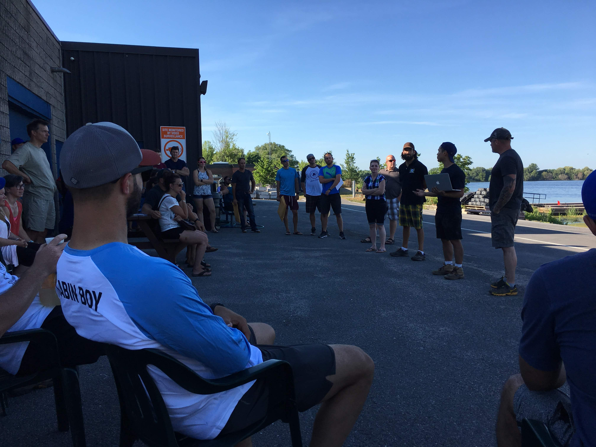
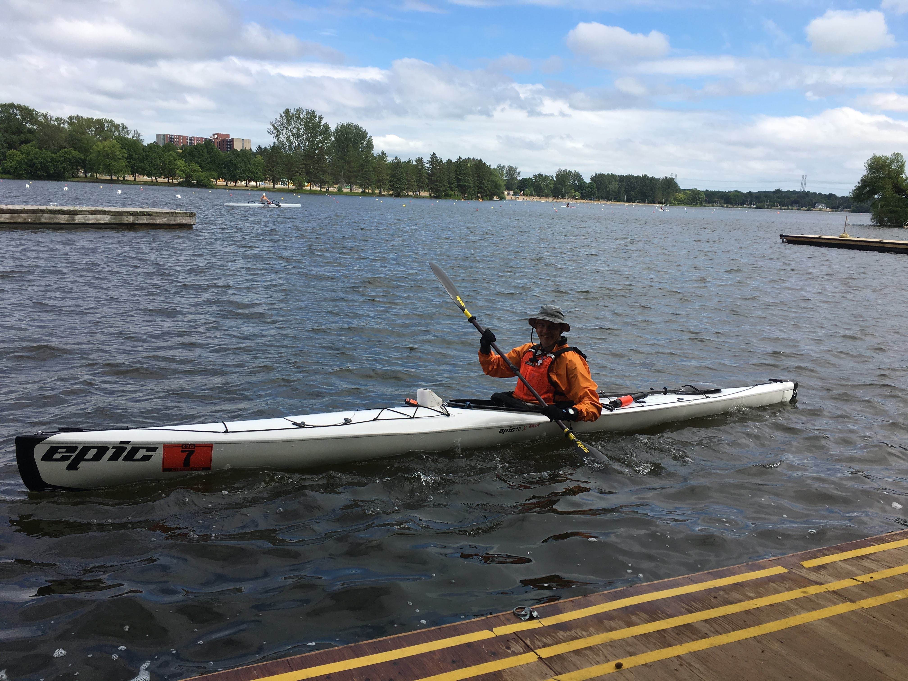

# K2O - Kingston to Ottawa

Ontario's longest marathon paddle race

## Why oh way

The [K2O](http://kingston2ottawa.ca) is an iconic race. For me it is THE iconic paddle race. It takes place on the [Rideau Waterway](https://en.wikipedia.org/wiki/Rideau_Canal) which is managed by Parks Canada and a designated UNESCO World Heritage Site. It connects the old capital Kingston with current capital Ottawa.

For those who want to explore the area there are good online resources available, eg. [Watson's Paddling Guide to the Rideau Canal](http://www.rideau-info.com/canal/paddling/guides.html). It's said that the tour from Ottawa to Kingston or vice versa is a good week-long trip.

There are other ultra marathon paddle races in North America like the [Yukon River Quest], [Missouri American Water MR340], the [Texas Water Safari]. Those are longer but all of them mandate stops or at least expect the racers to have breaks along the way.

Not so in the K2O. The winning teams often make it under 24 hours and the cut off time at the finish is 36 hours.

The first time I read about the race was in 2014. There was this webpage about this crazy race on the Rideau. At that time I only paddled a 14 feet long 29 inches wide sit-on-top kayak. By no means this was a boat in which one could race. As it turned out the race director was a coworker of my wife. He tried to bring me in as member of a relay team. But I didn't dare, I wasn't ready back then. I went to Iceland for a paddle trip that Summer. In the Fall I purchased my first fiber glass boat - a Wilderness Tempest 170PRO.

Things changed. The K2O changed. Now they offered a half distance for chicken like me who didn't want to go 200 km the very first time.
100 km seemed more doable.

I found another crazy guy. He works just down the hallway in my office. The two of us paddled from the 8th line bridge North of Westmontrose to Paris, Ontario on the Grand River. We logged [88.3 km](https://www.endomondo.com/users/2331405/workouts/578506690). Colleagues at work called it an "Epic Paddle". The name stuck. We were disappointed that we hadn't crossed the magical 90 km marker. So in 2017 we started a few kilometers upstream at the lower bridge of the Elora Gorge. After that day the odometer on my GPS show [93.4 km](https://www.endomondo.com/users/2331405/workouts/958850726). Given the new starting point it was also way more catchy to say: "We paddled from the Elora Gorge to Paris, ON in one day". Nobody knew where the 8th Line crosses the Grand after all.
This year - 2018 - we were four kayaks and one canoe to cover the [full distance](https://www.endomondo.com/users/2331405/workouts/1137787341). We're planning an **Epic Paddle** for the next year. It will be open for everybody who thinks can paddle 94km in 14ish hours. Perhaps we've started a tradition.

In August 2016 I took my 17ft touring kayak to the K&frac12;O. I went from Kingston to Smiths Falls in 16 hours 24 minutes. I had wait out a thunderstorm with lightning and some torrential rain which costed me one hour.
I noticed that the good paddlers all seem to be in an EPIC kayak (this time I mean the brand). After the race I decided if I'd ever go for the full distance I needed an EPIC.

I setup an alert on Kijiji. When an ad came up in September I could not not buy it.

I decided to start in 2017. We went to Florida on vacation in November 2016 where I was able to rent a brand new EPIC 18X Sport for two weeks. I paddled every day and clocked eventually 320 km in the mangroves. I registered. We had our Epic paddle in early Summer. Overall I logged more than 1,200 km. I had lined up a bigger shore crew to cover the night. I was prepared.

What I wasn't prepared for was injury.

I pinched a nerve in my right leg 10 days before the race. I followed my doctor's advice and cancelled my start the Tuesday before the 2017 K2O. I was devastated.

Another year, another race. In 2018 everything came together.

## The Route

The race starts from the Cataraqui Canoe Club in Kingston. First the paddlers have to go out to Lake Ontario before they turn around and come back into the sheltered waters of the Cataraqui River. The route leads North towards the Kingston Mills Lockstation, continues through Colonel By Lake into the River Styx to the Lower Brewers. Cranberry Lake follows the Upper Brewers. At the end of Whitefish Lake lies Jones Falls Lock. The waterway winds through the landscape to Sand Lake, Opinicon Lake, Indian Lake, Clear Lake and finally into Newboro Lake, the first bigger lake.
The Newboro Lockstation is the highest point on the way to Ottawa. After the lock is passed the way leads through the Upper Rideau Lake to Rideau Narrows.

The Narrows are the 8th portage of the race. The next leg is the second longest of the race. The paddlers will navigate through the Big Rideau and the Lower Rideau Lake to finally arrive in Poonamalie after more than 30 km.

The racer have to portage 11 locks over the next 35 km. When they leave the last one at Burritts Rapids Lock #17 then the _Long Reach_ begins. For endless 40 km there is no lock. It is the longest leg of the race.

The paddlers who made it to this place have already more than 180 km behind them. The remaining 14 km are a piece of cake. The last portage at the Black Rapids Lock #13 is a short 165 m. From here it's only 6 km until the racers cross the finishing line at the docks of the Rideau Canoe Club in Ottawa, close to Hog's Back.

# Race Days

## Getting there

We live in Kitchener, ON. We took Friday off from work and drove to Kingston. I had booked a hotel room less than 15 min drive away from the start at the Cataraqui Canoe Club. We checked in the afternoon. I had a good chat with the folks from [Infinite Blue]. My wife bought me paddle shorts for my birthday in September which I wore for the race.

I stored my boat at the club for the night. A big thank you to the club members for the permission to use their premises. From there we went to downtown Kingston for dinner. I had a big pasta meal with chicken; and beer.

The alarm went off at the ungodly time of 04:30am. While I was getting dressed I ran the coffee maker in the room. It was too early to eat something.
We arrived at the club by 05:15am. I moved my kayak out of the boat house and prepared for the start. I tied my little GPS cradle to the deck, put the charts into the SealLine map case and tethered it to the deck lines. I stored the paddle float behind the back bend, tied the spare paddle and the pump on the after deck.
The throw line and the food went into the day hatch.

I noticed a bit of wind. It was more than I'd have expected that early in the morning. The forecast for Saturday called for South to Southeasterly wind with speed around 10 - 15 km/h and even more in gusts. That didn't sit well with me. I remembered the conditions in 2016 when we had very strong winds from behind which made for a very technical paddling. My concerns were not so much about the river paddling. The wind would merely be an annoyance there. I was afraid of the segment in which we had go on the edge of Lake Ontario.

I capsized on Lake Huron while on vacation in the vincinity of Bayfield, ON. I blew several rolls and had to wet exit. I couldn't handle my paddle float either. I took me only a few minutes to swim onto the shore with my boat. But it had an impact on my selfconfidence. I exercised several times on Guelph Lake to improve my rolling and to gain experience with self rescue. But the feeling of uneasiness hadn't left me.

I put my mobile phone into energy saving mode. It should it would last for 30 hours. I decided to switch it off because that might not be enough. My idea was to switch it on again when I'd enter the long legs of the race. I nevertheless packed it into a waterproof sleeve and stored in the front pocket of my PFD secured with a carabiner.

The night before I had prepared a bowl of yogurt mixed with half a cup oatmeal and raisins. That was my breakfast. I calculated just under 2 hours before I'd arrive at the first lock station at Kingston Mills. Lynne would use the time to fill my thermos bottles with coffee. I had one and a half liter of water in my hydration bladder on my back which would be plenty.

I picked up my [SPOT3] device from the registration deck. The SPOT3 is a two-way satellite tracker. The device sends a position update every 5 min via satellite. It can be a live saver if one gets lost in remote areas. It gives the race organisers the position of each racers and also drives the live online tracker during the race. I could also replay the entire race as I found out on the webpage last night.

One last run to the bathroom where I found a short lineup and off I went to the dock.

The start was the usual crowded place. I alway stay at the end of the field. I compete for arrival not for a spot on the podium. While we were waiting for signal I noticed that there was already a paddler in the water and an empty kayak was pushed out of the way. Somebody capsized before the start.

We started eventually at 06:01:00am.

## Kingstons to Rideau Narrows (73 km)

The segment on the big lake was even more uncomfortable than I feared. The waves were probably 0.5m high coming from the left. I tried to cut through them to help my balance. A few times I almost went over.
While I was fighting the waves Shawn (Team Creek Freak) had already turned and passed me on his way back North. This man is a machine!
Finally I could catch a break behind the breakwater right next to the Ahoy! Rentals bouys. After I donned my gloves I moved on.

I made my way back into the Cataraqui River while uttering unquotable German and English swearwords. I took a bearing close to the wind to reach the protection of the Fort Frederick peninsula. There were some paddlers in recreational kayaks without a skirt. I wonder how much water they took while being out there. While I passed the RMC I spotted a canoe on the docks of the RMC. The guys had taken so much water that they had to go to shore to empty their boat.

The Cataraqui River offered sheltered waters. I made good progress and touched the dock at Kingston Mills after the first 12 km of the race at 07:32am.

I had to start in the "competetion" category because of my kayak. Originally I signed up for the "recreational" category as I did two years ago. The race organisation rejected my application and put me into the competetive group. That would not be a big issue execpt for the rule that a competetive paddler cannot have support moving his kayak. The rules mandate that I have to lift my boat out of the water without help from other people. I'm the only person to move my boat. My crew can stabilize the boat while getting in and out but must not move it. The exceptions are the locks at Old Slys and Long Island because those are too difficult to navigate. It would be safety hazard.

Ok then.

I have the following technique: First I lift the boat on my thighs and in a second step I put it on my (usually right) shoulder. I had forgotten that Kingston Mills is one of the longer portages. It is 350 m long and one has to go up 14 meters. After 100 m of carrying my kayak I surrendered and put the boat on my cart.
Before I continued I stored my Starbucks Latte and the ginger molasses cookie Lynne had for me. I know, that doesn't sound very sporty for some of the readers. But it works for me.

Behind Kingston Mills there lies the River Styx. I could see two kayakers in front of me. As I should learn later one of them was Brian King of Ottawa (Team Haulin' Yak - King). I was playing catch up.

After the more open River Styx the course leads through narrow channels. I passed the Lower and the Upper Brewers Mills.

At the race briefing on Friday night we were reminded of the Brass Point Bridge. It very low but if you keep your heads very low a paddler can pass it without problems.
When I approached the bridge it was opened for a jetski to pass through. The operator kept the cars waiting for another 30 seconds and let me pass as well. That was very convenient.

A word on the jetskies or Seadogs as the Bombardier brand is named. Those are a general annoyance. They seem to have less etiquette than "normal" boaters. I'm sure those jetski riders are nice people - on shore. But I came to hate them on the water.
At some particular occasion in one of the narrow channels befor Jones Falls Locks there were two vehicles: One male - probably the father and one with a female and a teenager. They slowly passed me coming from behind in a close distance creating a big wake. Then they stopped 50 m in front of me to discuss a matter while I was catching up and now I was passing them. Two minutes later they seems to have made a decision and move on just to pass me yet again. I was uttering deadly threats on my end towards to extinction of all jetski riders once and for all until they finally disappeared around the next river bend.

Lo and behold - five minutes later they were back returning from whereever they just went now passing me from the front. I considered to call in air support from the RCAF.

Those guys were just the first of many to come. As it turned out the faster they go the less wake they create. At the Newboro Lock I had some exchange about this with the guys from team Canoe Dig It and they had the same observation.

After the Brewers I caught up to Brian of team _Haulin' Yak - King_. He paddled a recreational kayak from Clearwater Design. I was amazed how well he was doing. Eventually he would cross the finishing line in Ottawa three hours ahead of me.
Brian told me that he was actually one of a group of four friends who had signed up for the race. I remember that we had a very brief chat while portaging in Kingston Mills. He didn't seem to have a support team. He told me that he had several people lined up for the different lock station and that the team for Kingston Mills didn't show. Later Lynne met his mother who was supporting all four of the team but gave priority to her son (what else would a mother do?!). The paddler who flipped at the start was one of Brian's buddies. He mentioned that the other three team member were less experienced paddlers. But he came well prepared. It was the first time he started in the K2O. He explained to me that he had paddled the route at least three times in preparation for the competition, but never without overnight stop. Once when they were trying to pull it through the waves on the Big Rideau were so high at night that they had leave the waters and camp overnight windbound.

As it turned out later Brian put his knowledge of the local waterways to a good use. Once he cut a corner going through a pipe I'd have never considered. At Jones Falls Locks he didn't pull out at the official dock. Instead he continued to paddle into Jones Falls Bay shortening the portage. He set in at the docks at Stone Arch Dam Ln. It didn't help much though because I still left before him. He's superior athleticism gave him that big advantage on the second. But for now I should see him before Smiths Falls.

After leaving the Jones Falls Lockstation the recommended course breaks off the official navigational channel and leads the paddlers through some very narrow connections into Sand Lake. Here I had my first encounter with a cluster of power boats with QC numbers which very racing for the next spot at Davis Lock. Those guys throw even bigger waves than the pesky jetskis. As long as I was aware of the coming wake I turn the kayak towards and cut through the wave. Kayaks are built for this. Canoes might have a more difficult time though.

Oh and by the way all those power boats where still waiting while I portaged Davis Lock unassisted.

At Chaffey's Lockstation I got new coffee from Lynne - yay! Off to Newboro Lake.

Newboro Lake is the first bigger lake and I had to consider the wind conditions. Two years ago I hugged the banks on my Port side. This year I tried to optimize the distance while avoiding the wind. I took a more direct route hopping from island to island while trying to stay in wind protected areas. I didn't matter much though but it was fun.

## Rideau Narrows to Poonamalie (30km)

At the Narrows I met _Dos Amigos_ and _Canoe Dig It_. This was lock #8 on our journey to Ottawa. We spent a few minutes together. I had a chat with Radu Crisu of _Dos Amigos_. We knew each other from the [Big East River X] in Huntsville. We compared our GPS recordings so far. I had logged a bit over 73 km and he was at over 75 km. We agreed that this was within the expected variation. Although we used the suggested GPX data from the race organisers we didn't paddle the _exact_ same course. At the end of our conversation Radu said: "75 km is much better than 73, because it is already in the fourth eighth of the race!". It was obvious that he was playing the same mindgames as I was and perhaps all of us. The overall distance is so overwhelming. The way I deal with is to divide the full distance into smaller pieces -- in 10% segments, in thirds, quarters, fifths and so on. We compare it to known routes from home like "I did the _EPIC paddle_ earlier this year which goes over 94 km. I'm still 19 km under that. No big deal!". Those thoughts help to deal with the long and sometimes monotone segments one has to go through.

The next section would be over 30 km long with no option to get additional food. I left my small 1.5 l Mocke bladder behind and stowed 4 l additional water in a MSR Dromedary bladder with hydration kit in the cockpit behind my backbend. The home made energy balls and a few Clif Bars and Lörabars went into my dayhatch. I knew the sun would set at 8:41pm that day. Daylight would be gone by 9:30pm. I planned to arrive at the next lock before it would be completely dark. I didn't pack any lights yet.

Lynne would leave the race now and drive to Ottawa where she would hand over the car to my brother-in-law Kent. The plan was that he would drive to Poonamalie to meet me there when I arrived.

The Narrows separate the Upper Rideau and the Big Rideau. Bigger lake meant big(ger) waves. The Southern end of the Big Rideau sees usually the biggest waves of the race. In 2014, when the race was organised for the very first time, the director even had to cancel the race for safety reasons because of the conditions. 3 km after the Narrows the lake opens. At the widest point the water stretches 6 km to the Southwest. That can be a lot of fetch to create some waves. But this year we were lucky. Although the waves were higher than on Newboro Lake it wasn't as uncomfortable as on Lake Ontario in the very first hour of the competition.

After another 5 km the paddlers leave the open area behind. They will pass Rideau Ferry after another two hours. Despite the name it is actually a road bridge. It marks the beginning of the Lower Rideau Lake - the last lake of the course.

This was the area were I had my first weak moments of this race. In the shady corners of my mind I was searching for lame excuses why I would surrender the race in Smith Falls. I would have paddled longer than I ever had by then. The race doesn't matter, who's so crazy to paddle 200 km in a row anyway.

Stupid things like that.

But I still had 16 oz Starbucks Latte in my Stanley thermos mug. The coffee combined with 150 gram marsipan lifted my spirits. After a short break I was able to keep a good speed around 7 km/h. I loudly sang German traditionals. Nobody could hear me, nobody could judge me, but it helped to mitigate the fatigue in the muscles, the pain.

Pain is an interesting thing. I experienced that if you ignore it long enough it will stop at some point. My shoulder-neck muscles were very sore. I had sometimes cramps in my inner thighs. But over time this became less and less an issue. I think the brain switches off certain communication lines in the body. As my colleague on Monday said: It's mind over matter. If you can manage that you'll be successful in the end.

So let's go then.

I want to give up.

No I don't.

Keep going!

Mindgames.

At the end of the Lower Rideau there is a potential short cut - the so called [Mud Cut]. I found the entrance on Google Maps. I created a waypoint in my GPS. I couldn't find it. After a brief irritation I just went back into the navigational channel and continued on the recommended route.

## Poonamalie to Buritts Rapids (36 km)

When I came in to Poonamalie dusk had set in but is was still light. Two years ago - when I paddled the first 100k for the K&frac12;O - it was already pitch black at my arrival. I was happy to see my brother-in-law at the dock expecting me. I gave him a big hug. We had a brief chat in which we decided to make all the big changes in Smith Falls where the parking lot is right at the dock and I could show him what I'd need and fetch some things he might not easily find in my car. I packed my head lights. When I left Poonamalie it was almost dark.

I hit Smiths Falls just before 10pm. It was the farthest I went in 2016. The stop is considered half time. It's actually more than half of the because I was already at 107 km. The 100 km racers had already taken off from here at 6pm. From here on I was in - for me - unknown territory.
While planning I had considered to change into new clothes. I skipped that. It would have been way too difficult to change. I was so stiff. It would have cost me another 5 min or more of time. I just donned my paddle jacket and switch from half finger to full finger gloves.

There would be another eight locks aka portages until I'd reach Burritts Rapids. The next lock was just 400 m away. I didn't even close my skirt. Needless to say that Kent couldn't make it. I carried my kayak over the 220 m to the put in place. It was now easier because since Newboro all locks were descending.

Next stop was at Old Slys Locks. This is one of the two locks in which I could get help portaging my boat. Kent missed me by two minutes or so. It took longer to drive from lock to lock than to paddle. The volunteer at Old Slys was a gentleman who did this for the fourth year in the row. He was spending he's weekend sitting under a canopy at a lock in rural Ontario to help paddlers portaging their boats through the night. I big shout out to all the volunteers who made this race possible. You guys were crucial for our success. All the portage routes were meticulously marked with glowing sticks. There was a person on every lock who guided me through the unknown trails. Thank you to the lady who gave me some of her tablets against my heartburn! I don't remember which lock it was. Somethings are just a blur.
I chatted with the gentlemen at Old Slys while he was carrying the bow of my kayak. I thanked him that he would help us crazy ones to fullfill our dream (nightmares?). He said that would be something I will remember on my dead bed. I've done something 95% of the people wouldn't do. There would be no regrets.

Thank you man! How could I ever consider to retire from a race where such fine people helping me.

Brian had caught up with me in Smiths Falls. I was getting weaker and he was getting stronger and stronger. I couldn't keep up with him anymore. I followed his little glowing light in front of me which finally disappeared. Sadly I didn't see him at the post-race meeting. I was told he had to catch a flight to the North West Territories the next morning where he'd work as an expedition guide. Great guy! (If you read this Brian, please get in touch).

Navigation by day was simple. One could follow the navigational channel which is marked by green and red buoys. Each bouy is marked with a unique number. All buoys with numbers are marked in the Nautical Chartbook from TrakMaps I was using. If you're in doubt where you are then just paddle to the next buoy, read the number and find it on the chart. Easy as pie (or is it PI?).

Navigation by night was interesting. I had use the official GPX track from the K2O organisers to create a route on my Garmin eTrex 20x. It follows mostly the navigational channel. The stress is on _mostly_. There are segments where the GPX route leads through the weeds which slows the boat down significantly. Those weeds stick also to the paddle. You have to clean up the thing constantly. The head lamps help. The Gemini Duo turned night into day. I could overlook the next 100 m of the course or even more. I didn't use it often though because I still tried to maintain my night vision.

I set my GPS to a display timeout of 30 seconds. When I arrive at a waypoint the eTrex would make a sound and the display would go on. I then had 30 seconds to turn the kayak to the bearing. The time was plenty. I then picked a star from the sky in front of me and steered towards it. I felt so cool. It was like the old polynesian navigators.

After Kilmarnock Lock there was such a turning point on the route which led me directly into the weeds. I struggled to find a way. I wanted to return to the navigational channel. While I fumbled with my charts I spotted a light closing in on me.

Somebody asked: "Are you ok?". I recognized Radu's voice.

I said: "Yes".

"Do you want to join us. The more the merrier as they say." I heard him chuckeling.

We staid close to each other for a brief period. But the _Dos Amigos_ navigated slightly different than I did and I move on leaving them behind - for now.

After five more locks I finally arrived at Burritts Rapids at the very same time as the _Dos Amigos_. Because of contruction there was a pedestrian bridge crossing the river which we had to portage. Eric - the race director - had told us about it. It would be 10 feet portage but we had to leave the boats, lift them out of the water and reenter on the other side. I didn't need that at 4am after more than 150 km paddling.

Kent was waiting for me at the dock. We restocked me with food and drinks. I switched my small bladder for the big one and put it back in the cockpit. I went to the bathroom because there was nothing coming for the next 6 or 7 hours.

I was apparently talking German to Kent as he told us later. Not that he was understanding anything. He just said: "Yes buddy, you're doing great." and "ahem" and "ah". I have no recollection of it.

The deep of the night was over. We could see the dawn on the horizon. I left my head lamps and the batteries with Kent who would drive home after he spent the entire night with me hopping from lock station to lock station.

###### What happened to Creek Freak?

The volunteers at the station told us a story about Shawn (Team Creek Freak).

Before _The Long Reach_ he was three hours ahead of the second boat which would have been _The Bickersons_ - also the overall winner of the 2016 race. It was the first time in the history of the race that it looked like a single kayak could beat the canoes.
One hour after he left Burritts Rapids he turned around and came back. The helpers think he got lost in a group of islands up North.

Eventually he finished just 8 minutes after the _The Bickersons_ just below 24 hours. Imaging what he could have achieved if he wouldn't have make that mistake.

He still won some prize money and also a door prize at the after race celebration. There was much teasing that he should put the money forward to a GPS. I congratulated him for his nevertheles phenomenal result and told him that I would never go without a GPS. He told me that he was using a GPS indeed! What happened was that at a break he fumbled his glow light and the GPS fell off his front pocket. When he put it back he did so upside down. He didn't realize his mistake until he reached Burritts Rapids again.

I think this is a classical case of "marathon stupid". It was late at night - he arrived at Burritts just after 8pm. He was paddling on a very high level for 14 hours. His brain wasn't functioning. All his blood was in his muscles. The brain shuts down as much as possible. I read about this phenomenon from my running coach. At marathons people go to the bathroom and when the leave the porta potty they continue into the wrong direction. They don't recognise it. Shawn had even less environmental signals. It was dark, he was exhausted. I think he should work with a route on his GPS. I don't know if he did. If he just loaded the GPS _track_ and didn't converted it to a route it could have contributed to the problem. Perhaps he can tell us next time I see him.

## The Long Reach (40km)

I left 4:48am. I looked at my GPS to find out the exact time of the sun rise which made it freeze. I had to remove the batteries to turn it on again. While I was doing it I realised that I was running on the same pair of batteries since the start. After 23 hours those were still going strong. I changed them anyway out of precaution. Who knows what conditions would lay ahead of me and whether I would be able to change it later. While I was tinkering with the device the _Dos Amigos_ paddled by. We wished each other luck and that was the last time I saw them on the water. The weather forecast called for wind with 10 - 20 km/h from Northeast and 60% rain probability on Sunday. Now, in the wee hours it was still completly calm.

Not for long though. At 05:30am the wind began to pick up. The Rideau River flows mainly towards Northeast. That meant headwind all the way to the finishing line. I was hoping the forecast would be a bit off but the weather turned out exactly to be as predicted.

I later checked the Environment Canada website for data which were measured: Wind speed was above 30 km/h with stronger gusts. It was disgusting. At times I made only 4 - 5 km/h. It felt less but at least the GPS was giving me the real data.

I was distraught.

Around 6:00am I stopped to eat and to consider my options. I left the last lock station only 16 min behind my "7.5 km/h schedule". I had a lot of buffer to make the cutoff in Long Island at 3pm. I had 35 km to go in 9 hours. That meant even if I would do only 4 km/h I could still make it. But it would be a grind.

And so I continued.

At 07:30am it started to rain.

I just keept going and going and going and going. Left - right - left - right - left - right - ...

I was so sleep deprived after 24 hours of paddling I started to see patterns in things around me which weren't there. There was this submarine on the left with legs like a squid moored in front of a mansion. Who'd need that on the Rideau. When I got closer it tourned out be an ordinary small power boat. What looked like the glass hemisphere was the outboard motor and the squid legs were just the fenders to protect the boat from damage.

I looked at this house behind the trees and it seems to have big letters on the wall. I tried to read what it meant just to recognise that the letters were the windows.

My mind started to fool around with my vision. I wonder if LSD would have a similar impact on ones brain.

"How are you doing this morning?"

All of a sudden there was somebody next to me on the right. It was a paddler on a Stellar surfski. He was the leader of the 50km field. They started at 6am from Burritts Rapids. I explained that I was one of the 200ers. He had some encouraging comments for me before he took off. That must have been John Dunkelberger. Thank you for the good words!

Only 10 minutes later I noticed far ahead of me a kayak in the water with a guy who tried to get back into the boat. He had to pay tribute to the windy conditions. I could see that he tried again and again to get back into the seat but each team he flipped over and found himself back in the river. I directed my boat towards him to offer him help. While I was slowly making progress another surfsky passed my on the left. But before any of us come close enough John regained control of his boat and continued.

A quarter after 8am I passed under the highway 416 bridge. That was a good uplifting feeling. I knew I was "closing in" on Ottawa. Everytime we drove over the bridge I said to Lynne: "One of these days I will paddle _under_ this road".

The wind didn't let up. I tried to find a little bit of protection switching sides but to not much avail.

After the race I looked at my GPS track. I found out that I stopped six times for several minutes to eat and to rest. I was at the end of my abilities.

Finally after 35 km and almost seven hours I could see Long Island. But the name was given for a reason. Another five kilometers had to be paddled before the lock finally appears.

## The Rest (16km)

## Finish at the Rideau Canoe Club

My GPS showed 196 km at this place.

[Yukon River Quest]: https://www.yukonriverquest.com/
[Missouri American Water MR340]: https://rivermiles.com/mr340/
[Texas Water Safari]: http://www.texaswatersafari.org/
[Infinite Blue]: (https://infiniteblue.blue/)
[SPOT3]: https://www.findmespot.com/en/index.php?cid=100

[tracks]: For those who interested in the details - here's the [link](https://drive.google.com/open?id=1bIGoepeJ0ixuNrj_76IFFbemKIE&usp=sharing) to the map with the tracks.
[Mud Cut]: https://www.google.ca/maps/place/44%C2%B052'22.7%22N+76%C2%B005'39.6%22W/@44.872984,-76.096535,715m/data=!3m2!1e3!4b1!4m6!3m5!1s0x0:0x0!7e2!8m2!3d44.872984!4d-76.0943407
