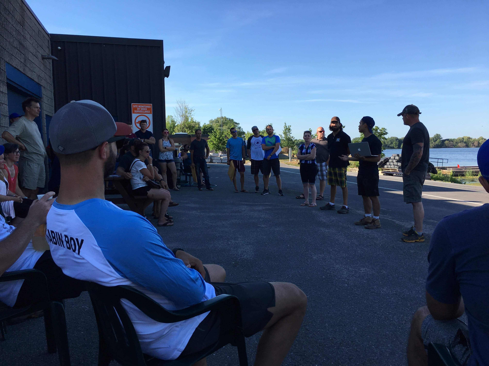

# K2O - Kingston to Ottawa

Ontario's longest marathon paddle race

## Why oh way

The [K2O](http://kingston2ottawa.ca) is an iconic race. For me it is THE iconic paddle race. It takes place on the [Rideau Waterway](https://en.wikipedia.org/wiki/Rideau_Canal) which is managed by Parks Canada and a designated UNESCO World Heritage Site. It connects the old capital Kingston with current capital Ottawa.

For those who want to explore the area there are good online resources available, eg. [Watson's Paddling Guide to the Rideau Canal](http://www.rideau-info.com/canal/paddling/guides.html). It's said that the tour from Ottawa to Kingston or vice versa is a good week-long trip.

There are other ultra marathon paddle races in North America like the [Yukon River Quest], [Missouri American Water MR340], the [Texas Water Safari]. Those are longer but all of them mandate stops or at least expect the racers to have breaks along the way.

Not so in the K2O. The winning teams often make it under 24 hours and the cut off time at the finish is 36 hours.

The first time I read about the race was in 2014. There was this webpage about this crazy race on the Rideau. At that time I only paddled a 14 feet long 29 inches wide sit-on-top kayak. By no means this was a boat in which one could race. As it turned out the race director was a coworker of my wife. He tried to bring me in as member of a relay team. But I didn't dare, I wasn't ready back then. I went to Iceland for a paddle trip that Summer. In the Fall I purchased my first fiber glass boat - a Wilderness Tempest 170PRO.

Things changed. The K2O changed. Now they offered a half distance for chicken like me who didn't want to go 200 km the very first time.
100 km seemed more doable.

I found another crazy guy. He works just down the hallway in my office. The two of us paddled from the 8th line bridge North of Westmontrose to Paris, Ontario on the Grand River. We logged [88.3 km](https://www.endomondo.com/users/2331405/workouts/578506690). Colleagues at work called it an "Epic Paddle". The name stuck. We were disappointed that we hadn't crossed the magical 90 km marker. So in 2017 we started a few kilometers upstream at the lower bridge of the Elora Gorge. After that day the odometer on my GPS show [93.4 km](https://www.endomondo.com/users/2331405/workouts/958850726). Given the new starting point it was also way more catchy to say: "We paddled from the Elora Gorge to Paris, ON in one day". Nobody knew where the 8th Line crosses the Grand after all.
This year - 2018 - we were four kayaks and one canoe to cover the [full distance](https://www.endomondo.com/users/2331405/workouts/1137787341). We're planning an **Epic Paddle** for the next year. It will be open for everybody who thinks can paddle 94km in 14ish hours. Perhaps we've started a tradition.

In August 2016 I took my 17ft touring kayak to the K&frac12;O. I went from Kingston to Smiths Falls in 16 hours 24 minutes. I had wait out a thunderstorm with lightning and some torrential rain which costed me one hour.
I noticed that the good paddlers all seem to be in an EPIC kayak (this time I mean the brand). After the race I decided if I'd ever go for the full distance I needed an EPIC.

I setup an alert on Kijiji. When an ad came up in September I could not not buy it.

I decided to start in 2017. We went to Florida on vacation in November 2016 where I was able to rent a brand new EPIC 18X Sport for two weeks. I paddled every day and clocked eventually 320 km in the mangroves. I registered. We had our Epic paddle in early Summer. Overall I logged more than 1,200 km. I had lined up a bigger shore crew to cover the night. I was prepared.

What I wasn't prepared for was injury.

I pinched a nerve in my right leg 10 days before the race. I followed my doctor's advice and cancelled my start the Tuesday before the 2017 K2O. I was devastated.

Another year, another race. In 2018 everything came together.

## The Route

The race starts from the Cataraqui Canoe Club in Kingston. First the paddlers have to go out to Lake Ontario before they turn around and come back into the sheltered waters of the Cataraqui River. The route leads North towards the Kingston Mills Lockstation, continues through Colonel By Lake into the River Styx to the Lower Brewers. Cranberry Lake follows the Upper Brewers. At the end of Whitefish Lake lies Jones Falls Lock. The waterway winds through the landscape to Sand Lake, Opinicon Lake, Indian Lake, Clear Lake and finally into Newboro Lake, the first bigger lake.
The Newboro Lockstation is the highest point on the way to Ottawa. After the lock is passed the way leads through the Upper Rideau Lake to Rideau Narrows.

The Narrows are the 8th portage of the race. The next leg is the second longest of the race. The paddlers will navigate through the Big Rideau and the Lower Rideau Lake to finally arrive in Poonamalie after more than 30 km.

The racer have to portage 11 locks over the next 35 km. When they leave the last one at Burritts Rapids Lock #17 then the _Long Reach_ begins. For endless 40 km there is no lock. It is the longest leg of the race.

The paddlers who made it to this place have already more than 180 km behind them. The remaining 14 km are a piece of cake. The last portage at the Black Rapids Lock #13 is a short 165 m. From here it's only 6 km until the racers cross the finishing line at the docks of the Rideau Canoe Club in Ottawa, close to Hog's Back.

# Race Days

## Getting there

We live in Kitchener, ON. We took Friday off from work and drove to Kingston. I had booked a hotel room less than 15 min drive away from the start at the Cataraqui Canoe Club. We checked in the afternoon. I had a good chat with the folks from [Infinite Blue]. My wife bought me paddle shorts for my birthday in September which I wore for the race. I stored my boat at the club for the night. A big thank you to the club members for the permission to use their premises. Then we went for dinner in downtown Kingston. I had a big pasta meal with chicken.

The alarm went off at the ungodly time of 04:30am. While I was getting dressed I ran the coffee maker in the room. It was too early to eat something.
We arrived at the club by 05:15am. I moved my kayak out of the boat house and prepared for the start. I tied my little GPS cradle to the deck, put the charts into the SealLine map case and tethered it to the deck lines. I stored the paddle float behind the back bend, tied the spare paddle and the pump on the after deck.
The throw line and the food went into the day hatch.

I noticed a bit of wind. It was more than I'd have expected that early in the morning. The forecast for Saturday called for South to Southeasterly wind with speed around 10 - 15 km/h and even more in gusts. That didn't sit well with me. I remembered the conditions in 2016 when we had very strong winds from behind which made for a very technical paddling. My concerns were not so much about the river paddling. The wind would merely be an annoyance there. I was afraid of the segment in which we had go on the edge of Lake Ontario.

I capsized on Lake Huron while on vacation in the vincinity of Bayfield, ON. I blew several rolls and had to wet exit. I couldn't handle my paddle float either. I took me only a few minutes to swim onto the shore with my boat. But it had an impact on my selfconfidence. I exercised several times on Guelph Lake to improve my rolling and to gain experience with self rescue. But the feeling of uneasiness hadn't left me.

I put my mobile phone into energy saving mode. It should it would last for 30 hours. I decided to switch it off because that might not be enough. My idea was to switch it on again when I'd enter the long legs of the race. I nevertheless packed it into a waterproof sleeve and stored in the front pocket of my PFD secured with a carabiner.

The night before I had prepared a bowl of yogurt mixed with half a cup oatmeal and raisins. That was my breakfast. I calculated just under 2 hours before I'd arrive at the first lock station at Kingston Mills. Lynne would use the time to fill my thermos bottles with coffee. I had one and a half liter of water in my hydration bladder on my back which would be plenty.

I picked up my [SPOT3] device from the registration deck. The SPOT3 is a two-way satellite tracker. The device sends a position update every 5 min via satellite. It can be a live saver if one gets lost in remote areas. It gives the race organisers the position of each racers and also drives the live online tracker during the race. I could also replay the entire race as I found out on the webpage last night.

One last run to the bathroom where I found a short lineup and off I went to the dock.

The start was the usual crowded place. I alway stay at the end of the field. I compete for arrival not for a spot on the podium. While we were waiting for signal I noticed that there was already a paddler in the water and an empty kayak was pushed out of the way. Somebody capsized before the start.

We started eventually at 06:01:00am.

## Kingstons to Rideau Narrows (73 km)

The segment on the big lake was even more uncomfortable than I feared. The waves were probably 0.5m high coming from the left. I tried to cut through them to help my balance. A few times I almost went over.
While I was fighting the waves Shawn (Team Creek Freak) had already turned and passed me on his way back North. This man is a machine!
Finally I could catch a break behind the breakwater right next to the Ahoy! Rentals bouys. After I donned my gloves I moved on.

I made my way back into the Cataraqui River while uttering unquotable German and English swearwords. I took a bearing close to the wind to reach the protection of the Fort Frederick peninsula. There were some paddlers in recreational kayaks without a skirt. I wonder how much water they took while being out there. While I passed the RMC I spotted a canoe on the docks of the RMC. The guys had taken so much water that they had to go to shore to empty their boat.

The Cataraqui River offered sheltered waters. I made good progress and touched the dock at Kingston Mills after the first 12 km of the race at 07:32am.

I had to start in the "competetion" category because of my kayak. Originally I signed up for the "recreational" category as I did two years ago. The race organisation rejected my application and put me into the competetive group. That would not be a big issue execpt for the rule that a competetive paddler cannot have support moving his kayak. The rules mandate that I have to lift my boat out of the water without help from other people. I'm the only person to move my boat. My crew can stabilize the boat while getting in and out but must not move it. The exceptions are the locks at Old Slys and Long Island because those are too difficult to navigate. It would be safety hazard.

Ok then.

I have the following technique: First I lift the boat on my thighs and in a second step I put it on my (usually right) shoulder. I had forgotten that Kingston Mills is one of the longer portages. It is 350 m long and one has to go up 14 meters. After 100 m of carrying my kayak I surrendered and put the boat on my cart.
Before I continued I stored my Starbucks Latte and the ginger molasses cookie Lynne had for me. I know, that doesn't sound very sporty for some of the readers. But it works for me.

Behind Kingston Mills lies the River Styx. I could see two kayakers in front of me. As I should learn later one of them was Brian King of Ottawa (Team Haulin' Yak - King). I was playing catch up.

After the more open River Styx the course leads through narrow channels. I passed the Lower and the Upper Brewers Mills.

At the race briefing on Friday night we were reminded of the Brass Point Bridge. It very low but if you keep your heads very low a paddler can pass it without problems.
When I approached the bridge it was opened for a jetski to pass through. The operator kept the cars waiting for another 30 seconds and let me pass as well. That was very convenient.

A word on the jetskies or Seadogs as the Bombardier brand is named. Those are a general annoyance. They seem to have less etiquette than "normal" boaters. I'm sure those jetski riders are nice people - on shore. But I came to hate them on the water.
At some particular occasion in one of the narrow channels befor Jones Falls Locks there were two vehicles: One male - probably the father and one with a female and a teenager. They slowly passed me coming from behind in a close distance creating a big wake. Then they stopped 50 m in front of me to discuss a matter while I was catching up and now I was passing them. Two minutes later they seems to have made a decision and move on just to pass me yet again. I was uttering deadly threats on my end towards to extinction of all jetski riders once and for all until they finally disappeared around the next river bend.

Lo and behold - five minutes later they were back returning from whereever they just went now passing me from the front. I considered to call in air support from the RCAF.

Those guys were just the first of many to come. As it turned out the faster they go the less wake they create. At the Newboro Lock I had some exchange about this with the guys from team Canoe Dig It and they had the same observation.

After leaving the Upper Brewers the recommded course breaks off the official navigational channel and leads the paddlers through some very narrow connections into Sand Lake. Here I had my first encounter with a cluster of power boats with QC numbers which very racing for the next spot at Davis Lock. Those guys throw even bigger waves than the pesky jetskis. As long as I was aware of the coming wake I turn the kayak towards and cut through the wave. Kayaks are built for this. Canoes might have a more difficult time though.

Oh and by the way all those power boats where still waiting while I portaged Davis Lock unassisted.

At Chaffey's Lockstation I got new coffee from Lynne - yay! Off to Newboro Lake.

Newboro Lake is the first bigger lake and I had to consider the wind conditions. Two years ago I hugged the banks on my Port side. This year I tried to optimize the distance while avoiding the wind. I took a more direct route hopping from island to island while trying to stay in wind protected areas. I didn't matter much though but it was fun.[^]

## Rideau Narrows to Poonamalie (30km)

_Dos Amigos_, _Canoe Dig It_ and I spent a few minutes together at the Narrow Lock Station. I had a chat with Radu Crisu of _Dos Amigos_. (We knew each other from the [Big East River X] in Huntsville where we paddled side by side for a while last year. Radu used his paddles intentionally "the wrong way" and he explained to me why he thought that was a good thing.) We compared our GPS recordings so far. I had logged a bit over 73 km and he was at over 75 km. We agreed that this was within the expected variation. Although we used the suggested GPX data from the race organisers we didn't paddle the _exact_ same course. At the end of our conversation Radu said: "75 km is much better than 73, because it is already in the fourth eighth of the race!". It was obvious that he was playing the same mindgames as I was and perhaps all of us. The overall distance is so overwhelming therefore we divide the full distance into smaller pieces -- in 10% segments, in thirds, quarters, fifths and so on. We compare it to known routes from home like "I did the _EPIC paddle_ earlier this year which goes over 94 km. I'm still 19 km under that. No big deal!". Those thoughts help to deal with the long and monotone segments one has to go through.

The next segment would be over 30 km long with no option to get additional food. I left my small 1.5 l Mocke bladder behind and stowed 4 l additional water in a MSR Dromedary bladder with hydration kit in the cockpit behind my backbend. I also put some extra food, the home made energy balls and a few Clif Bars and Lörabars into my dayhatch. I knew the sun would set at 8:41pm that day. Daylight would be gone by 9:30pm. I planned to arrive at the next lock before it would be completely dark. I didn't pack any lights yet.

Lynne would leave the race now and drive to Ottawa where she would hand over the car to my brother-in-law Kent. The plan was that he would drive to Poonamalie to meet me there when I arrived.

The Narrows separate the Upper Rideau and the Big Rideau. Bigger lake meant big(ger) waves. The Southern end of the Big Rideau sees usually the biggest waves of the race. In 2014, when the race was organised for the very first time, the director even had to cancel the race for safety reasons because of the conditions. 3 km after the Narrows the lake opens. At the widest point the water stretches 6 km to the Southwest. That can be a lot of fetch to create some waves. But this year we were lucky. Although the waves were higher than on Newboro Lake it wasn't as uncomfortable as on Lake Ontario in the very first hour of the competition.

After another 5 km the paddlers leave the open area behind. They will pass the road bridge at Rideau Ferry after two hours. Rideau Ferry marks the beginning of the Lower Rideau Lake, the last lake of the course.

This was the area were I had some weak moments. In the shady corners my mind I was searching for lame excuses why I would surrender the race in Smith Falls. I would have paddled longer than I ever had by then. The race doesn't matter, who's so crazy to paddle 200 km in a row anyway.

Things like that.

I still had 16 oz Starbucks Grande Latte in my Stanley thermos mug. The coffee combined with 150 gram marsipan lifted my spirits. After a short break I was able to keep a good speed around 7 km/h. I loudly sang German traditionals. Nobody could hear me, nobody could judge me, but it helped to mitigate the fatigue in the muscles, the pain.

Pain is an interesting thing. I experienced if you ignore it long enough it will stop at some point. My shoulder-neck muscles were very sore. I had sometimes cramps in my inner thighs. But over time this became less and less an issue. I think the brain switches off certain communication lines in the body. As my colleague on Monday said: It's mind over matter. If you can manage that you'll be successful in the end.

So let's go then.

I want to give up.

No I don't.

Mindgames.

At the end of the Lower Rideau is a potential short cut - the so called [Mud Cut]. I found the entrance on Google Maps. I created a waypoint in my GPS. I couldn't find the [Mud Cut]. After a brief irritation I just went back into the navigational channel and continued on the recommended route.

[Mud Cut]: https://www.google.ca/maps/place/44%C2%B052'22.7%22N+76%C2%B005'39.6%22W/@44.872984,-76.096535,715m/data=!3m2!1e3!4b1!4m6!3m5!1s0x0:0x0!7e2!8m2!3d44.872984!4d-76.0943407

### Poonamalie to Buritts Rapids

When I came in to Poonamalie there was still light. Two years ago - when I paddled the first 100k for the K&frac12;O - it was already pitch black at my arrival. I was happy to see and to hear my brother-in-law at the dock expecting me. I gave him a big hug. We hat a brief chat in which we decided to make all the big changes in Smith Falls where the parking lot is right at the dock and I could show him what I'd need and fetch some things he might not easily find in my car.

- Navigation at night
- GPS, Charts, Stars

- extra portage in Burritts Rapids Lock at pedestrian bridge

#### What ever happened to Shawn aka The Creek Freak?

### The Long Reach (40km)

- I left Burritts Rapids Lock at dawn. The river was still like a mirror. All that changed just before sunrise.
- The wind started at 5:30am, according to Environment Canada >30 km/h, gusts felt stronger, came from Northeast, difficult to find protection

- rain started about two hours later at 7:30am
- speed stopped dramatically with the wind
- I started to calculate whether I could still make it within the cutoff times
- I considered to call my shore crew for an early extraction
- I stopped multiple times (6x) for several minutes to eat and to rest. I was at the end of my abilities.

After 35 km The paddlers will see the Long Island after 35 km. But the name was given for a reason. Another five kilometers have to be paddled before the lock finally appears.

### The Rest (16km)

### Finish at the Rideau Canoe Club

My GPS showed 196 km at this place.

# Technical Analysis

## Course

- GPS track not always reliable because of weed
- some short cuts taken by locals
- couldn't find the entry to the mud cut
- swirveled my way on Newboro Lake

## Timing

### Paddling

### Locks

- spent 3 hours 40 minutes portaging the locks which includes replenishing food, water and bathroom stops

# Preparation

## Training

I finished the K 1/2 O in 2016. This year I was ready to go the full distance.

Starting in the Fall I prepare for some half marathon races in the early Spring. I usually participate in the Chilly Halfmarathon in Burlington, ON on the first Sunday in March.

I started paddling this Spring as soon as the Grand River was safe end of March. I was on the water on 36 days before the K2O. I paddled The Dam Hespeler Race in April (20km) and the Big East River X Race in May (40km).
I also organized and paddled the 3rd edition of the "EPIC Paddle" from Elora Gorge to Paris, ON on the Grand River. This is an open event hosted by our Waterloo Wellington Canoe and Kayak Club of which I'm a member. This covers a distance of about 95 km slow moving downstream. This year it took us about 14 hours from 6am to 8pm.

Then I paddled 65 km in 10 hours overnight from Wilsons Flat to Cambridge, ON to test my night equipment and to learn about myself paddling alone in the dark.

Overall I logged 770 km since March.

## Food, Hydration

From experiences in 2016 I knew that I wouldn't be very hungry during the race. I prepared "energy balls" from a mix of dates, oatmeal and beet root juice. I also had several 150g bars of marsipan, Clif Bars and Lörabars. My wife bought cookies at Starbucks and Apple Fritter at Tim Hortons during the race.

I eat one cookie, the apple fritter, two of the marsipan bars. I forced myself to eat one energy ball at least every 2 hours.

I drank water, coffee, apple juice, coca cola. I have a hydration bladder on the back of my PFD and a [4l MSR Dromedary](https://www.msrgear.com/water/water-storage/dromedary-bags) in the kayak during the long leg to Poonamalie and the _Long Reach_. Throughout the race I probably drank 1.5l coffee, 1l apple juice, 2 cans of coke, 4-5l water.

I had problems with heartburn. I'll need to bring Tums or something similar if I'm going to do this again.

## Logistics

For the navigation I relied primarily on the GPS and the Atlas from [TrakMap](https://www.trakmaps.com/en/products/printed/details/rideau-canal-kingston-ottawa-614/). [Navigational Charts](http://www.charts.gc.ca/documents/charts-cartes/manitoba-index.pdf) from Fisheries and Oceans Canada, #1512 and #1513 are available from certified printer, eg. [World of Maps in Ottawa](http://worldofmaps.com/) on Wellington St W and Parkdale Ave.
Those are helpful in the preparation at home. I looked at them on those long and cold Winter nights.

I downloaded charts for the GPS from [OpenStreetMap](http://garmin.openstreetmap.nl). I used Garmin Basecamp to create all lock stations as waypoints. I didn't use directly the GPX track provided by the race organizers. Instead I created a route from the track. To learn more about the differences between tracks and routes visit the [Garmin website](https://support.garmin.com/en-US/?faq=v0rJAHy2hq3prHjRlxdRw5&searchType=noProduct).

## Shore Crew

Every racer needs a shore crew. You need the best crew you can assemble. I had the best crew _in da world_ :-). My wife, my brother-in-law and one of my wife's nephews helped me along the way. I cannot overstate how important those helpers are. They keep your spirits up, the help you with the portages, they replenish your food and drinks and they will be successful with you. You also don't want to disappoint them! These thoughts help you in your weaks moments.

## Equipment

### Boat

2016 I paddled the race in my Wilderness System Tempest 170PRO. Back then I noticed how many other racers had EPICs. I decided that if I'd ever come back for the full distance I'd need one too.

I setup an alert on Kijiji. Lo and behold an ad showed up in the Fall of 2016 and I was able to buy a - barely - used boat. I'm now paddling an [EPIC 18X Sport](https://www.epickayaks.com/18x-sport) model 2012. It's the same boat in which Freya Hoffmeister cirumnavigated Australia and two thirds of South America. That should be enough for me.

My paddle is an [EPIC mid wing full carbon paddle](https://www.epickayaks.com/mid-wing-paddle), size 210-220cm from [Kayaksport Canada](http://www.kayaksport.net/) (thank you Dav!). My spare is a [Werner Cyprus](http://wernerpaddles.com/paddles/high-angle/cyprus) (220cm) from [Adventure Guide in Waterloo](http://advguide.com/).

### Mandatory safety equipment

I'm using the following safety equipment:

- [Mocke PFD](https://mockepaddling.com/product/mocke-racer-pfd/) with built-in 1.5l hydration bladder
- Whistle
- [NRS Paddle Float](https://www.nrs.com/product/1598/nrs-sea-kayak-paddle-float)
- 50 feet throw line
- [Scotty pump](https://www.mec.ca/en/product/4007-257/Pump-13-5%22-with-Float)

### Other Equipment

My GPS is a [Garmin eTrex 20x](https://www.gpscity.ca/garmin-etrex-20x).
I got the sun and moon times from the [US Navy](http://aa.usno.navy.mil/data/docs/RS_OneYear.php).

The lights are [Black Diamond Spot](https://www.blackdiamondequipment.com/en_CA/headlamps-and-lanterns/spot-BD620634_cfg.html) and [Gemini Duo](https://gemini-lights.com/products/duo) with 4-cell battery.

I'm using a [portaging cart](https://www.mec.ca/en/product/5032-082/Mini-Tuff-Tire-Wheels).

[Yukon River Quest]: https://www.yukonriverquest.com/
[Missouri American Water MR340]: https://rivermiles.com/mr340/
[Texas Water Safari]: http://www.texaswatersafari.org/
[Infinite Blue]: (https://infiniteblue.blue/)
[SPOT3]: https://www.findmespot.com/en/index.php?cid=100

[^] For those who interested in the details - here's the [link](https://drive.google.com/open?id=1bIGoepeJ0ixuNrj_76IFFbemKIE&usp=sharing) to the map with the tracks.
